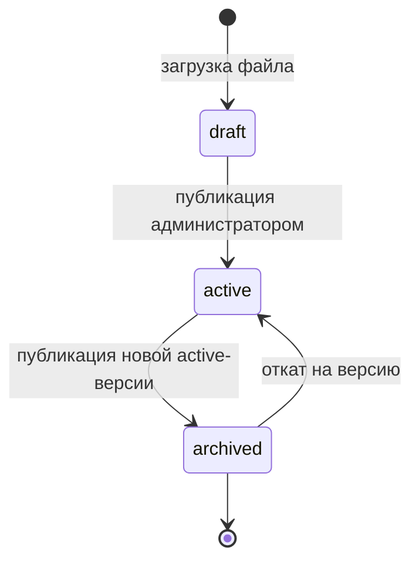
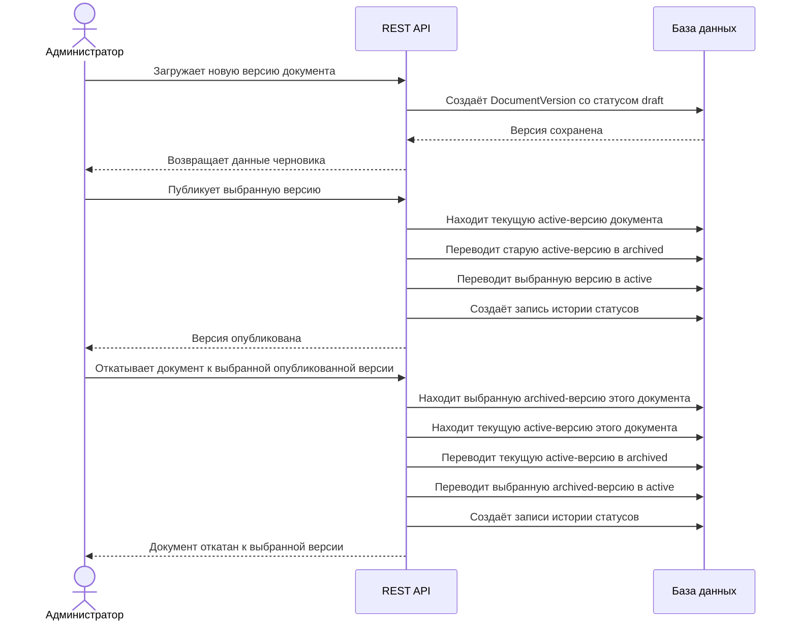
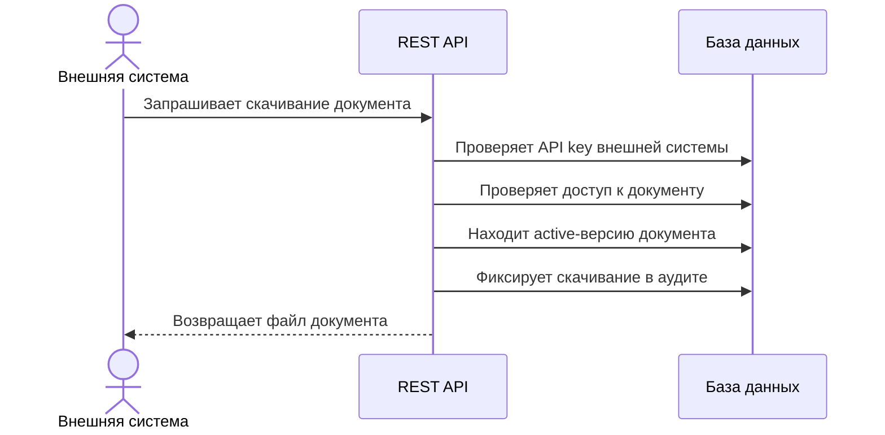

## 1. Технологический стек

Проект необходимо реализовать на следующем стеке:

- Python 3.11+
- Django 5
- Django REST Framework
- PostgreSQL

Frontend реализовывать не нужно.

Взаимодействие с системой должно происходить через REST API.

Основные сценарии работы с системой должны быть доступны для проверки одним из способов:

- через Swagger-документацию, где можно выполнить запросы и проверить функциональные возможности системы;
- через подготовленную Postman-коллекцию с примерами запросов.

---

## 2. Сущности проекта и основные действия

Центральная сущность системы — документ.

Документ необходимо рассматривать как карточку нормативно-справочного материала. Сам файл, номер версии и статус
актуальности должны относиться не к документу, а к версии документа.

Новая версия документа сначала загружается как черновик. Актуальной она становится только после явной публикации
администратором.

---

## 2.2. Документ

### Назначение

Документ — это логическая карточка нормативно-справочного материала.

Документ не хранит сам файл и не имеет собственного статуса актуальности. Статус относится к конкретной версии
документа.

### Типы документов

В системе должно быть два типа документов:

| Значение                         | Название                  |
|----------------------------------|---------------------------|
| `regulation`                     | Регламент                 |
| `methodological_recommendations` | Методические рекомендации |

### Примерные поля

| Поле            | Описание                                                   |
|-----------------|------------------------------------------------------------|
| `id`            | Уникальный идентификатор документа                         |
| `title`         | Название документа                                         |
| `description`   | Краткое описание документа                                 |
| `document_type` | Тип документа: регламент или методические рекомендации     |
| `is_common`     | Признак общего документа, доступного всем внешним системам |
| `created_at`    | Дата создания карточки документа                           |
| `updated_at`    | Дата последнего обновления карточки документа              |

### Основные действия

- создать карточку документа;
- получить список документов;
- получить один документ по идентификатору;
- обновить основные данные документа;
- найти документ по названию;
- отфильтровать документы по типу;
- посмотреть активную версию документа;
- посмотреть список всех версий документа.

---

## 2.3. Версия документа

### Назначение

Версия документа — это конкретный загруженный файл, связанный с документом.

У одного документа может быть несколько версий. Только одна версия документа может быть активной.

### Статусы версии документа

| Значение   | Название | Описание                                                                                  |
|------------|----------|-------------------------------------------------------------------------------------------|
| `draft`    | Черновик | Версия загружена в систему, но ещё не опубликована и не доступна внешним системам         |
| `active`   | Активная | Актуальная опубликованная версия документа, доступная внешним системам                    |
| `archived` | Архивная | Предыдущая версия документа, которая больше не является актуальной, но хранится в системе |

### Примерные поля

| Поле             | Описание                                       |
|------------------|------------------------------------------------|
| `id`             | Уникальный идентификатор версии                |
| `document`       | Документ, к которому относится версия          |
| `version_number` | Номер версии документа                         |
| `file_path`      | Путь до сохранённого файла                     |
| `file_name`      | Исходное имя файла                             |
| `status`         | Статус версии: черновик, активная или архивная |
| `uploaded_at`    | Дата загрузки версии                           |
| `uploaded_by`    | Пользователь, загрузивший версию               |

### Основные действия

- загрузить первую версию документа;
- загрузить новую версию для существующего документа;
- получить список всех версий документа;
- получить активную версию документа;
- скачать файл конкретной версии;
- опубликовать черновик версии;
- откатить документ к выбранной ранее опубликованной версии;
- автоматически архивировать прошлую активную версию при публикации новой активной версии.

### Правила работы с версиями

Любая новая загруженная версия документа сначала получает статус `draft`.

Загрузка новой версии не должна менять текущую активную версию документа.

Публикация версии выполняется отдельным действием администратора.

При публикации версии:

- выбранная версия получает статус `active`;
- предыдущая активная версия этого же документа автоматически получает статус `archived`;
- остальные архивные версии остаются без изменений;
- черновики других версий остаются в статусе `draft`.

Откат версии выполняется отдельным действием администратора. Откат не создаёт новую версию документа и не меняет номера
версий: система только переключает статусы уже существующих версий.

Откат разрешён только к версии этого же документа, которая ранее была опубликована и сейчас находится в статусе
`archived`. Черновик (`draft`) нельзя сделать активным через откат: для черновика используется обычная публикация.

При откате версии:

- выбранная архивная версия получает статус `active`;
- текущая активная версия этого же документа получает статус `archived`;
- номера версий остаются прежними;
- карточка документа, тип документа и правила доступа к документу не меняются;
- остальные архивные версии остаются без изменений;
- черновики остаются в статусе `draft`;
- для версий, у которых изменился статус, создаются записи истории изменения статусов.

После отката внешние системы получают новую активную версию по тем же правилам доступа, которые уже настроены для
документа.

Пример: у документа есть версия с `version_number = 1` в статусе `archived` и версия с `version_number = 2` в статусе
`active`. При откате к версии `1` версия `1` снова становится `active`, а версия `2` переходит в `archived`.

---

## 2.4. История изменения статусов версии

### Назначение

История изменения статусов нужна для того, чтобы было понятно, кто и когда изменил статус версии документа.

Так как статус относится к версии документа, история изменения статусов также должна быть связана с версией документа.

### Примерные поля

| Поле               | Описание                        |
|--------------------|---------------------------------|
| `id`               | Уникальный идентификатор записи |
| `document_version` | Версия документа                |
| `old_status`       | Предыдущий статус версии        |
| `new_status`       | Новый статус версии             |
| `changed_by`       | Пользователь, изменивший статус |
| `changed_at`       | Дата изменения статуса          |

### Основные действия

- автоматически создавать запись при изменении статуса версии, в том числе при публикации и откате;
- получить историю изменения статусов по конкретной версии документа;
- увидеть, кто и когда изменил статус версии.

---

## 2.5. Внешняя система

### Назначение

Внешняя система — это система-клиент, которая обращается к сервису НСИ за доступными ей документами.

Внешняя система должна получать только активные версии документов.

### Примерные поля

| Поле         | Описание                                 |
|--------------|------------------------------------------|
| `id`         | Уникальный идентификатор внешней системы |
| `name`       | Название внешней системы                 |
| `api_key`    | Ключ доступа к API                       |
| `created_at` | Дата создания записи                     |

### Основные действия

- зарегистрировать внешнюю систему;
- выдать внешней системе API key;
- получить через API список активных версий документов, доступных этой системе;
- скачать доступный документ через API.

---

## 2.6. Доступность документов для внешних систем

### Назначение

Не все документы обязательно должны быть доступны всем внешним системам.

В системе необходимо предусмотреть два варианта доступа:

1. Общие документы.
2. Документы, доступные только конкретным внешним системам.

### Правила доступа

Если у документа установлен признак `is_common = true`, активная версия такого документа доступна всем внешним системам.

Если у документа установлен признак `is_common = false`, необходимо явно указать, каким внешним системам доступен этот
документ.

Для ограниченного доступа можно реализовать отдельную связующую сущность между документом и внешней системой.

### Примерные поля связующей сущности

| Поле              | Описание                        |
|-------------------|---------------------------------|
| `id`              | Уникальный идентификатор записи |
| `document`        | Документ                        |
| `external_system` | Внешняя система                 |
| `created_at`      | Дата выдачи доступа             |

### Основные действия

- выдать внешней системе доступ к документу;
- отозвать доступ внешней системы к документу;
- получить список документов, доступных конкретной внешней системе;
- при обращении внешней системы отдавать только разрешённые документы.

---

## 2.7. Аудит действий

### Назначение

Аудит нужен для фиксации ограниченного набора важных действий, связанных с доступом внешних систем к документам.

В рамках тестового задания не нужно логировать все действия администратора с документами и версиями.

Откат версии относится к административным действиям с версиями и не требует отдельной записи в аудите действий. Его
достаточно фиксировать через историю изменения статусов версии.

### Действия, которые нужно логировать

| Значение          | Описание                                   | Кто выполняет действие |
|-------------------|--------------------------------------------|------------------------|
| `file_downloaded` | Скачивание файла документа                 | Внешняя система        |
| `access_granted`  | Выдача внешней системе доступа к документу | Администратор          |
| `access_revoked`  | Отзыв доступа внешней системы к документу  | Администратор          |

### Примерные поля

| Поле               | Описание                                                     |
|--------------------|--------------------------------------------------------------|
| `id`               | Уникальный идентификатор записи                              |
| `user`             | Администратор, если действие выполнено внутри системы        |
| `external_system`  | Внешняя система, если действие связано с внешней системой    |
| `document`         | Документ, с которым связано действие                         |
| `document_version` | Версия документа, если действие связано со скачиванием файла |
| `action`           | Тип действия                                                 |
| `created_at`       | Дата и время действия                                        |
| `metadata`         | Дополнительная информация о действии                         |

### Основные действия

- автоматически создать запись аудита при скачивании файла внешней системой;
- автоматически создать запись аудита при выдаче доступа внешней системе;
- автоматически создать запись аудита при отзыве доступа у внешней системы;
- получить список записей аудита;
- отфильтровать аудит по документу, внешней системе, действию и дате.

---

## 2.8. Статистика и простые отчёты

### Назначение

Статистика нужна для простого анализа использования документов внешними системами.

Отдельную сложную аналитическую подсистему реализовывать не нужно.

### Источник данных для статистики

Статистику скачиваний можно строить на основе записей аудита с действием `file_downloaded`.

### Что нужно учитывать

- сколько раз внешняя система скачала документ;
- какие документы скачивались чаще всего;
- какие внешние системы чаще всего скачивали документы.

### Простые отчёты

Необходимо реализовать выгрузку одного или нескольких простых отчётов в файл.

Формат выгрузки:

- CSV.

Примеры отчётов:

- список документов с количеством скачиваний;
- список внешних систем с количеством скачиваний документов;

Отчёт должен скачиваться файлом через отдельный endpoint.
